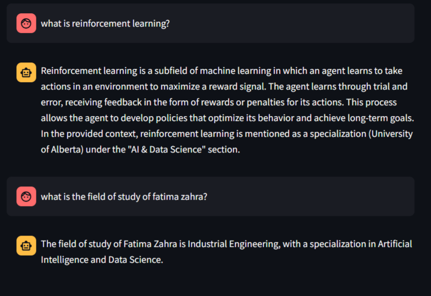

# PDF Chat with General Knowledge

A Streamlit-based application that combines PDF document analysis with general knowledge capabilities. Users can upload PDFs and ask questions about their content, or engage in general conversation with the AI.

## features

- PDF Upload and Processing
- Context-Aware Responses
- General Knowledge Fallback
- Persistent Vector Storage
- Real-time Response Generation

## Prerequisites

Before running the application, ensure you have:

- Python 3.8 or higher installed
- [Ollama](https://ollama.ai/) installed and running locally
- Sufficient disk space for vector storage

## Installation

1. Clone the repository:
```bash
git clone <https://github.com/f-zh-oubella/RAG_app.git>
cd RAG_app
```

2. Create a virtual environment (recommended):
```bash
python -m venv venv
source venv/bin/activate  # On Windows : venv\Scripts\activate
```

3. Install the required dependencies:
```bash
pip install -r requirements.txt
```

4. Ensure Ollama is running:
```bash
ollama serve
```

5. Pull the required model:
```bash
ollama pull llama3.1
```

## Usage

1. Start the application:
```bash
streamlit run app.py
```
2. Upload a PDF document (optional)

3. Start asking questions in the chat interface:
   - Questions about the uploaded PDF content
   - General knowledge questions

## Project Structure

```
RAG-app/
├── app.py              # Main application file
├── requirements.txt    # Project dependencies
├── README.md          # Project documentation
└── pdf_chroma_db/     # Vector database storage (created on first run)
```

## Example Usage



In this example interaction:
1. The first question "what is reinforcement learning?" is answered using the model's general knowledge since this information wasn't in the uploaded document
2. The second question about Fatima Zahra's field of study is answered accurately based on the information from the uploaded document


## How It Works

1. **PDF Processing**:
   - Documents are split into chunks
   - Text chunks are converted to embeddings
   - Embeddings are stored in a Chroma vector database

2. **Question Answering**:
   - For PDF-related questions: Retrieves relevant context from the vector store
   - For general questions: Uses the model's built-in knowledge
   - Combines both sources when appropriate

3. **Vector Storage**:
   - Enables quick retrieval of relevant information
   - Preserves context between sessions