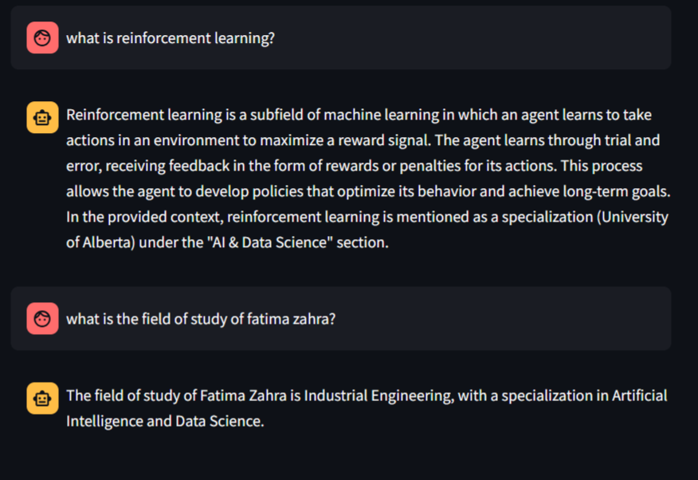

# PDF Chat with General Knowledge

A Streamlit-based application that combines PDF document analysis with general knowledge capabilities. Users can upload PDFs and ask questions about their content, or engage in general conversation with the AI.

## Features

Basic App (`app.py`):
- PDF Upload and Processing
- Context-Aware Responses
- General Knowledge Fallback

Upgraded App (`upgraded_app.py`):
- All basic features plus:
- Configurable Model Selection (Llama 3.1, Llama 2, Mistral)
- Customizable PDF Processing Parameters
- Adjustable Retrieval Settings
- Interactive Parameter Tuning
- Real-time Configuration Updates

## Prerequisites

Before running the application, ensure you have:

- Python 3.8 or higher installed
- [Ollama](https://ollama.ai/) installed and running locally
- Sufficient disk space for vector storage

## Installation

1. Clone the repository:
```bash
git clone <https://github.com/f-zh-oubella/RAG_app.git>
cd RAG_app
```

2. Create a virtual environment (recommended):
```bash
python -m venv venv
source venv/bin/activate  # On Windows : venv\Scripts\activate
```

3. Install the required dependencies:
```bash
pip install -r requirements.txt
```

4. Ensure Ollama is running:
```bash
ollama serve
```

5. Pull the required models:
```bash
# For basic app
ollama pull llama3.1

# For upgraded app (additional models (optional))
ollama pull llama2
ollama pull mistral
```

## Usage

### Basic App
1. Start the application:
```bash
streamlit run app.py
```
2. Upload a PDF document (optional)
3. Start asking questions in the chat interface

### upgradeded App
1. Start the application:
```bash
streamlit run upgraded_app.py
```
2. Click on the help (ⓘ) icons next to each parameter to understand their functions
3. Configure the parameters in the sidebar:
   - Select your preferred LLM model
   - Adjust text splitting parameters (chunk size, overlap)
   - Fine-tune retrieval parameters (k, fetch_k, threshold)
4. Upload a PDF document (optional)
5. Start asking questions in the chat interface

### Parameters

Click the help (ⓘ) icon next to each parameter in the sidebar for detailed explanations of:

**Model Selection:**
- Choose between Llama 3.1 (default), Llama 2, and Mistral

**Text Splitting Parameters:**
- Chunk Size: Control the size of text segments
- Chunk Overlap: Adjust overlap between segments

**Retrieval Parameters:**
- Number of Chunks (k): Set number of relevant chunks to retrieve
- Fetch Candidates (fetch_k): Adjust candidate pool size
- Relevance Threshold: Fine-tune similarity matching

## Project Structure

```
RAG-app/
├── app.py              # Basic application file
├── upgraded_app.py     # Advanced application with configurable parameters
├── requirements.txt    # Project dependencies
├── README.md          # Project documentation
└── pdf_chroma_db/     # Vector database storage (created on first run)
```

## Example Usage



In this example interaction:
1. The first question "what is reinforcement learning?" is answered using the model's general knowledge since this information wasn't in the uploaded document
2. The second question about Fatima Zahra's field of study is answered accurately based on the information from the uploaded document

## How It Works

1. **PDF Processing**:
   - Documents are split into chunks
   - Text chunks are converted to embeddings
   - Embeddings are stored in a Chroma vector database

2. **Question Answering**:
   - For PDF-related questions: Retrieves relevant context from the vector store
   - For general questions: Uses the model's built-in knowledge
   - Combines both sources when appropriate

3. **Vector Storage**:
   - Enables quick retrieval of relevant information
   - Preserves context between sessions

4. **Parameter Configuration** (upgraded App):
   - Model selection affects both chat responses and embeddings
   - Text splitting parameters influence document processing
   - Retrieval parameters impact search relevance and context

## Tips for Parameter Tuning

- Start with the default parameters
- Adjust chunk size based on your document's structure
- Increase overlap for better context preservation
- Adjust k and fetch_k based on response accuracy
- Fine-tune threshold based on relevance needs
- Use the "Reset to Defaults" button if needed

Click the help (ⓘ) icons in the sidebar for detailed parameter descriptions and recommendations.